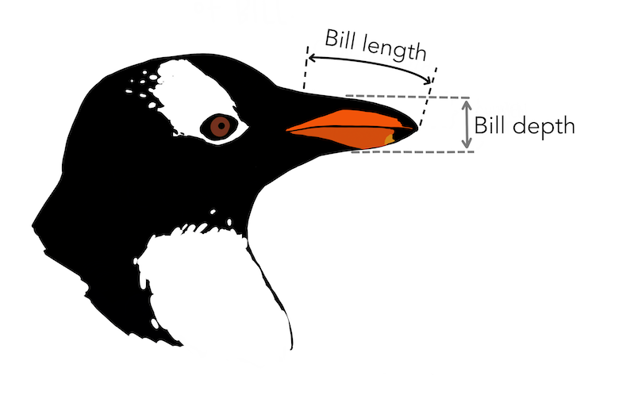

## Uzdevumi

1.  Atrodiet internetā kādu interesantu datu kopu klasificēšanai.
2.  Aprakstiet, kā Jūs sapratāt šos datus.
3.  Izmēģiniet koku ģeneratoru C4.5 (J48) ar dažādām minNumObj vērtībām, ar pruningu un bez, visai treniņa kopai un ar kros-validāciju.
4.  Kādi sanāca precizitātes procenti un koku izmēri? Ko šie rezultāti nozīmē?
5.  Vai, apskatot iegūtos kokus, radās kāda labāka izpratne par datiem?
6.  Atkārtojiet savus eksperimentus ar izvēlēto datu kopu, izmantojot WEKAs piedāvāto algoritmu LMT vai kādu citu lēmumu koku ģenerēšanas algoritmu. Vai rezultāts iznāca interesantāks nekā J48?

## 1., 2. Izvēlētā datukopa

Sākumā mēģināju strādāt ar citu datu kopu ([šo](https://archive.ics.uci.edu/dataset/848/secondary+mushroom+dataset)), bet koki sanāca ļoti lieli (rekords bija size of the tree: 16034) un tos bija grūti interpretēt, pat vizualizācija nedarbojās. Tāpēc nolēmu izmantot vienkāršākus datus.

Es izvēlējos R datu kopu `penguins` no pakotnes `{palmerpenguins}`. Tā satur mērījumus par pieaugušajiem pingvīniem, kas barojas ap Pālmera polārstaciju. Dati ietver informāciju par trīs pingvīnu sugām: Adélie, Chinstrap un Gentoo. Dati satur 344 ierakstus, un katrā ierakstā ir šāda informācija:

-   piederību sugai (`species`) (faktors, 3 līmeņi)
-   salu, kurā tas tika izmērīts (`island`) (faktors, 3 līmeņi)
-   knābja garumu milimetros (`bill length`)
-   knābja dziļumu milimetros (`bill depth`)
-   spārna garumu milimetros (`flipper length`)
-   ķermeņa masu gramos (`body mass`)
-   dzimumu (`sex`)
-   pētījuma gadu (`year`)

Un, lai Jūs zinātu, kur mēra knābja dziļumu, zemāk ir shēma:



### Datukopas pirmsapstāde

Es izmantošu šo datukopu, lai klasificētu pingvīnus pa sugām. Šim uzdevumam man nav nepieciešama informācija par dzimumu un gadu, tādēļ noņemšu šīs kolonnas, kā arī pārvietošu kolonnu `species` beigās, jo WEKA par klasi automātiski ņem pēdējo kolonnu. Visus kategoriju mainīgos pārveidošu par faktoriem, jo tas ir nepieciešams WEKA'i. Datus saglabāšu WEKA'i lasāmā formātā.

```{r pakotnes, include=FALSE}
library(dplyr)
library(foreign)
library(tidyverse)
library(palmerpenguins)
```

```{r dataset, warning=FALSE, message=FALSE}
pingvini <- penguins #dati

pingvini <- pingvini %>% 
  select(-sex, -year) %>% 
  relocate(species, .after = last_col())

pingvini_f <- pingvini %>%
  mutate(across(everything(),
                ~ if (is.numeric(.x)) .x else as.factor(.x)))

write.arff(pingvini_f, file = "./pingvini.arff")
```

## 3. Koku ģenerators C4.5 (J48)

**Izmantotie iestatījumi:**

-   `batchSize = 100`
-   `binarySplits = False`
-   `collapseTree = True`
-   `confidenceFactor = 0.25`
-   `debug = False`
-   `doNotCheckCapabilities = False`
-   `doNotMakeSplitPointActualValue = False`
-   `numDecimalPlaces = 2`
-   `numFolds = 3`
-   `reducedErorPruning = False`
-   `savelnstanceData = False`
-   `seed = 1`
-   `subtreeRaising = False`
-   `unpruned = False`
-   `useLaplace = False`
-   `useMDLcarrection = True`

Un kā testa veidu izmantošu `Percentage split = 66%`

### minNumObj = 1

Ar `minNumObj = 1` tika iegūts šāds koks:

```         
flipper_length_mm <= 206
|   bill_length_mm <= 43.3
|   |   bill_length_mm <= 42.3: Adelie (139.81/1.41)
|   |   bill_length_mm > 42.3
|   |   |   flipper_length_mm <= 189: Chinstrap (4.02/0.02)
|   |   |   flipper_length_mm > 189: Adelie (7.04/0.02)
|   bill_length_mm > 43.3
|   |   island = Biscoe
|   |   |   bill_length_mm <= 47: Adelie (1.09/0.09)
|   |   |   bill_length_mm > 47: Gentoo (1.09)
|   |   island = Dream: Chinstrap (59.0/1.0)
|   |   island = Torgersen: Adelie (2.18)
flipper_length_mm > 206
|   island = Biscoe: Gentoo (122.38)
|   island = Dream
|   |   bill_length_mm <= 44.9: Adelie (1.0)
|   |   bill_length_mm > 44.9: Chinstrap (5.0)
|   island = Torgersen: Adelie (1.38)

Number of Leaves  :     11
Size of the tree :  19
```

Patērētais laiks:

```         
Time taken to build model: 0 seconds
Time taken to test model on test split: 0 seconds
```

Modeļa precizitāte un konfūzijas matrica:

```         
Correctly Classified Instances         113               96.5812 %
Incorrectly Classified Instances         4                3.4188 %

  a  b  c   <-- classified as
 55  2  0 |  a = Adelie
  2 22  0 |  b = Chinstrap
  0  0 36 |  c = Gentoo
```

Iegūtais koks nav ļoti liels, bet gribētos vēl mazāku. Precizitāte ir augsta. Klasifikācijas kļūdas parādījās tikai starp divām sugām.

### minNumObj = 2

Ar minimālo objektu skaitu vienādu ar diviem tika iegūts šāds koks:

```         
flipper_length_mm <= 206
|   bill_length_mm <= 43.3
|   |   bill_length_mm <= 42.3: Adelie (139.81/1.41)
|   |   bill_length_mm > 42.3
|   |   |   flipper_length_mm <= 189: Chinstrap (4.02/0.02)
|   |   |   flipper_length_mm > 189: Adelie (7.04/0.02)
|   bill_length_mm > 43.3
|   |   island = Biscoe: Gentoo (2.18/1.0)
|   |   island = Dream: Chinstrap (59.0/1.0)
|   |   island = Torgersen: Adelie (2.18)
flipper_length_mm > 206
|   island = Biscoe: Gentoo (122.38)
|   island = Dream: Chinstrap (6.0/1.0)
|   island = Torgersen: Adelie (1.38)

Number of Leaves  :     9
Size of the tree :  15
```

Patērētais laiks:

```         
Time taken to build model: 0 seconds
Time taken to test model on training data: 0 seconds
```

Modeļa precizitāte un Konfūzijas matrica:

```         
Correctly Classified Instances         113               96.5812 %
Incorrectly Classified Instances         4                3.4188 %

  a  b  c   <-- classified as
 55  2  0 |  a = Adelie
  2 22  0 |  b = Chinstrap
  0  0 36 |  c = Gentoo
```

Koka precizitāte un pielaistās kļūdas nav mainījušās, salīdzinot ar iepriekšējo modeli. Tomēr koks kļuva mazāks.

### minNumObj = 5

Ar `minNumObj = 5` tika iegūts šāds koks:

```         
flipper_length_mm <= 206
|   bill_length_mm <= 43.3
|   |   bill_length_mm <= 42.3: Adelie (139.81/1.41)
|   |   bill_length_mm > 42.3
|   |   |   bill_depth_mm <= 17.9: Chinstrap (5.03/1.03)
|   |   |   bill_depth_mm > 17.9: Adelie (6.04/0.02)
|   bill_length_mm > 43.3
|   |   body_mass_g <= 4100: Chinstrap (51.3/0.3)
|   |   body_mass_g > 4100
|   |   |   bill_length_mm <= 48.8: Adelie (6.04/2.02)
|   |   |   bill_length_mm > 48.8: Chinstrap (6.04/0.04)
flipper_length_mm > 206
|   island = Biscoe: Gentoo (122.38)
|   island = Dream: Chinstrap (6.0/1.0)
|   island = Torgersen: Adelie (1.38)

Number of Leaves  :     9
Size of the tree :  16
```

Patērētais laiks:

```         
Time taken to build model: 0 seconds
Time taken to test model on test split: 0 seconds
```

Modeļa precizitāte un Konfūzijas matrica:

```         
Correctly Classified Instances         109               93.1624 %
Incorrectly Classified Instances         8                6.8376 %

  a  b  c   <-- classified as
 55  1  1 |  a = Adelie
  2 18  4 |  b = Chinstrap
  0  0 36 |  c = Gentoo
```

Palielinot minimālo objektu skaitu zara beigās līdz pieciem, koka precizitāte samazinājās līdz 93,16 %, un nepareizi klasificēto vienību skaits divkāršojās. Šoreiz nepareizi klasificēti tika objekti no visām trīm sugām.


### minNumObj = 10

Ar minimālo objektu skaitu vienādu ar desmit tika iegūts šāds koks:

```         
flipper_length_mm <= 206
|   bill_length_mm <= 43.3: Adelie (150.88/5.44)
|   bill_length_mm > 43.3: Chinstrap (63.37/5.37)
flipper_length_mm > 206
|   bill_depth_mm <= 17: Gentoo (119.7/0.35)
|   bill_depth_mm > 17: Chinstrap (10.06/5.06)

Number of Leaves  :     4
Size of the tree :  7
```

Patērētais laiks:

```         
Time taken to build model: 0 seconds
Time taken to test model on test split: 0 seconds
```

Modeļa precizitāte un Konfūzijas matrica:

```         
Correctly Classified Instances         109               93.1624 %
Incorrectly Classified Instances         8                6.8376 %

  a  b  c   <-- classified as
 55  1  1 |  a = Adelie
  2 18  4 |  b = Chinstrap
  0  0 36 |  c = Gentoo
```
“Precizitāte saglabājās nemainīga salīdzinājumā ar iepriekšējo koku, taču koka izmērs būtiski samazinājās – no 16 līdz 7 lapām.


### unpruned = True

**Tālākai pārbaudei izmantošu `minNumObj = 2`, lai būtu, kur izvērsties.**.

Man parādījās kļūda:

```         
Problem evaluating classifier: Subtree raising does not need to be unset for unpruned trees!
```

Tādēļ pārgāju uz `subtreeRaising = True`.

Neveicot koka apcirpšanu, ar minimālo objektu skaitu zara beigās minNumObj = 2 tika iegūts šāds koks:

```         
flipper_length_mm <= 206
|   bill_length_mm <= 43.3
|   |   bill_length_mm <= 42.3: Adelie (139.81/1.41)
|   |   bill_length_mm > 42.3
|   |   |   flipper_length_mm <= 189: Chinstrap (4.02/0.02)
|   |   |   flipper_length_mm > 189: Adelie (7.04/0.02)
|   bill_length_mm > 43.3
|   |   island = Biscoe: Gentoo (2.18/1.0)
|   |   island = Dream: Chinstrap (59.0/1.0)
|   |   island = Torgersen: Adelie (2.18)
flipper_length_mm > 206
|   island = Biscoe: Gentoo (122.38)
|   island = Dream: Chinstrap (6.0/1.0)
|   island = Torgersen: Adelie (1.38)

Number of Leaves  :     9
Size of the tree :  15
```

Patērētais laiks:

```         
Time taken to build model: 0 seconds
Time taken to test model on test split: 0 seconds
```

Modeļa precizitāte un Konfūzijas matrica:

```         
Correctly Classified Instances         114               97.4359 %
Incorrectly Classified Instances         3                2.5641 %

  a  b  c   <-- classified as
 55  2  0 |  a = Adelie
  1 23  0 |  b = Chinstrap
  0  0 36 |  c = Gentoo
```

Salīdzinot ar iepriekšējo koku ar tādu pašu minimālo objektu skaitu, šim kokam ir nedaudz augstāka precizitāte (par 0,85 %) un uz vienu nepareizi klasificētu objektu mazāk, neskatoties uz to, ka koka izmērs ir palicis nemainīgs.


### Percentage split = 33%

Tā kā iepriekšējais koks izrādījās nedaudz labāks, turpmāk izmantosšu: 
`subtreeRaising = True`
`unpruned = True`

Šoreiz treniņu kopa veidoja tikai 33% no oriģinālajiem novērojumiem (iepriekš izmantoti 66%).

Iegūts ir šāds koks:

```
flipper_length_mm <= 206
|   bill_length_mm <= 43.3
|   |   bill_length_mm <= 42.3: Adelie (139.81/1.41)
|   |   bill_length_mm > 42.3
|   |   |   flipper_length_mm <= 189: Chinstrap (4.02/0.02)
|   |   |   flipper_length_mm > 189: Adelie (7.04/0.02)
|   bill_length_mm > 43.3
|   |   island = Biscoe: Gentoo (2.18/1.0)
|   |   island = Dream: Chinstrap (59.0/1.0)
|   |   island = Torgersen: Adelie (2.18)
flipper_length_mm > 206
|   island = Biscoe: Gentoo (122.38)
|   island = Dream: Chinstrap (6.0/1.0)
|   island = Torgersen: Adelie (1.38)

Number of Leaves  : 	9
Size of the tree : 	15
```

Patērētais laiks:

```         
Time taken to build model: 0 seconds
Time taken to test model on test split: 0 seconds
```

Modeļa precizitāte un Konfūzijas matrica:

``` 
Correctly Classified Instances         220               95.6522 %
Incorrectly Classified Instances        10                4.3478 %

  a  b  c   <-- classified as
 99  2  3 |  a = Adelie
  0 39  5 |  b = Chinstrap
  0  0 82 |  c = Gentoo
```

Salīdzinot ar iepriekšējo modeli, koka izmērs nav mainījies. Savukārt koka precizitāte nedaudz samazinājās (par 1,78%), un šoreiz neviens no Adélie pingvīniem netika klasificēts kā Chinstrap, tomēr radās problēmas ar Gentoo pingvīnu klasifikāciju.

### Use training set
*Pārējie iestatījumi nav mainījušies kopš iepriekšējā modeļa.*

Šī opcija nozīmē, ka WEKA treniņa un testa datiem izmanto vienu un to pašu datu kopu. 

Iegūtais koks ir šāds:
```
flipper_length_mm <= 206
|   bill_length_mm <= 43.3
|   |   bill_length_mm <= 42.3: Adelie (139.81/1.41)
|   |   bill_length_mm > 42.3
|   |   |   flipper_length_mm <= 189: Chinstrap (4.02/0.02)
|   |   |   flipper_length_mm > 189: Adelie (7.04/0.02)
|   bill_length_mm > 43.3
|   |   island = Biscoe: Gentoo (2.18/1.0)
|   |   island = Dream: Chinstrap (59.0/1.0)
|   |   island = Torgersen: Adelie (2.18)
flipper_length_mm > 206
|   island = Biscoe: Gentoo (122.38)
|   island = Dream: Chinstrap (6.0/1.0)
|   island = Torgersen: Adelie (1.38)

Number of Leaves  : 	9
Size of the tree : 	15
```
Patērētais laiks:

```         
Time taken to build model: 0 seconds
Time taken to test model on test split: 0 seconds
```

Modeļa precizitāte un Konfūzijas matrica:

``` 
Correctly Classified Instances         339               98.5465 %
Incorrectly Classified Instances         5                1.4535 %

   a   b   c   <-- classified as
 149   2   1 |   a = Adelie
   1  67   0 |   b = Chinstrap
   1   0 123 |   c = Gentoo
```

Koka izmēri nav mainījušies kopš iepriekšējās reizes. Precizitāte ir palielinājusies. No visiem datiem nepareizi tika klasificēti 5 objekti, taču vismaz viena kļūda tika pielaista katras sugas klasifikācijā.


### Cross-validation
*Pārējie iestatījumi nav mainījušies kopš iepriekšējā modeļa.*

Foldu skaits = 10.

Ir iegūts šāds koks: 

```
flipper_length_mm <= 206
|   bill_length_mm <= 43.3
|   |   bill_length_mm <= 42.3: Adelie (139.81/1.41)
|   |   bill_length_mm > 42.3
|   |   |   flipper_length_mm <= 189: Chinstrap (4.02/0.02)
|   |   |   flipper_length_mm > 189: Adelie (7.04/0.02)
|   bill_length_mm > 43.3
|   |   island = Biscoe: Gentoo (2.18/1.0)
|   |   island = Dream: Chinstrap (59.0/1.0)
|   |   island = Torgersen: Adelie (2.18)
flipper_length_mm > 206
|   island = Biscoe: Gentoo (122.38)
|   island = Dream: Chinstrap (6.0/1.0)
|   island = Torgersen: Adelie (1.38)

Number of Leaves  : 	9
Size of the tree : 	15
```
Patērētais laiks:

```         
Time taken to build model: 0 seconds
```

Modeļa precizitāte un Konfūzijas matrica:

``` 
Correctly Classified Instances         334               97.093  %
Incorrectly Classified Instances        10                2.907  %

   a   b   c   <-- classified as
 147   4   1 |   a = Adelie
   2  66   0 |   b = Chinstrap
   3   0 121 |   c = Gentoo
```

Koka izmēri nav mainījušies, salīdzinot ar iepriekšējo modeli. Kļūdu skaits dubultojās, bet, ņemot vērā kopējo novērojumu skaitu, tas tikai nedaudz ietekmēja modeļa precizitāti (tā samazinājās par 1,45%). Parādījās vairāk kļūdu Gentoo pingvīnu klasifikācijā.


## 4. Kādi sanāca precizitātes procenti un koku izmēri? Ko šie rezultāti nozīmē?

Pie katra modeļa apraksta tika sniegta atsevišķa atbilde.


## 5. Vai, apskatot iegūtos kokus, radās kāda labāka izpratne par datiem?

Jā, lēmumu koki palīdzēja labāk saprast, kuras pazīmes ir vissvarīgākās pingvīnu sugu atšķiršanai datu ietvaros, kā arī kļūdu rašanās iemeslus.

Galvenais svarīguma kritērijs ir spārnu garums, pēc kura gandrīz vienmēr var atšķirt Gentoo sugu, jo tā parasti ir lielāka. Sekundārais atlases kritērijs ir salu nosaukums, jo divas no sugām apdzīvo tikai vienu salu, bet trešā – visas.

Visbiežāk tiek sajaukti Adelie un Chinstrap pingvīni, jo to ķermeņa izmēri un knābja proporcijas var pārklāties. Sākumā gandrīz nebija kļūdu Gentoo pingvīnu klasifikācijā. Taču, kad parametrs `unpruned` tika iestatīts uz `True`, parādījās vairāk šo sugu klasifikācijas kļūdu, kas, manuprāt, saistīts ar to, ka, neskatoties uz to, ka suga ir atšķirīga, pastāv pazīmju variabilitāte sugā, un pārāk sarežģīts koks sāk pārpielāgoties (overfitting), klasificējot to kā citu sugu.


## LMT algoritm

Pēdējo eksperimentu atkārtoju, izmantojot LMT algoritmu. LMT koka galos tiek veidoti loģistiskās regresijas modeļi.

Iestātījumi ir:
- batchSize = 100
- convertNominal = False
- debug = False
- doNotCheckCapabilities = False
- doNotMakeSplitPointActualValue = False
- errorOnProbabilities = False
- fastRegression = True
- minNumInstances = 2
- numBoostinglterations = -1 
- numDecimalPlaces = 2
- SsplitOnResiduals = False
- useAIC = False
- weightTrimBeta = 0.0

Kā pārbaudes veids tika izvēlēta 10 foldu krosvalidācija.

WEKA neizveidoja “īstā” koka struktūru, bet tika iegūta šāda informācija:

```
LM_1:19/19 (344)

Number of Leaves  :  1
Size of the Tree :  1

```
Tas nozīmē, ka viens lineārs modelis jau spēj pietiekami labi klasificēt datus, un papildu koka zari klasifikācijas precizitāti būtiski neuzlabo.

Modelis:

```
LM_1:
Class Adelie :
24.95 + 
[island=Torgersen] * 1.82 +
[bill_length_mm] * -1.54 +
[bill_depth_mm] * 2.35

Class Chinstrap :
-13.48 + 
[island=Dream] * 4.52 +
[bill_length_mm] * 0.94 +
[bill_depth_mm] * -0.46 +
[body_mass_g] * -0.01

Class Gentoo :
-23.77 + 
[island=Biscoe] * 6.55 +
[bill_length_mm] * 0.27 +
[bill_depth_mm] * -2.14 +
[flipper_length_mm] * 0.2  +
[body_mass_g] * 0 

```
Katras sugas rindkopa parāda, kā katrs mainīgais ietekmē varbūtību, ka pingvīns pieder konkrētajai sugai.


Patērētais laiks:

```         
Time taken to build model: 0.19 seconds
```

Modeļa precizitāte un Konfūzijas matrica:

``` 
Correctly Classified Instances         342               99.4186 %
Incorrectly Classified Instances         2                0.5814 %

   a   b   c   <-- classified as
 152   0   0 |   a = Adelie
   1  67   0 |   b = Chinstrap
   1   0 123 |   c = Gentoo
```

Iegūta modeļa precizitāte ir 99,42%, kas ir augstāka nekā visiem pārējiem modeļiem. Nepareizi klasificēti tika tikai 2 objekti. Visi 152 Adelie pingvīni tika atpazīti pareizi, savukārt viens Chinstrap un viens Gentoo īpatnis kļūdaini tika klasificēti kā Adelie.

Šī koka izveidošana aizņēma nedaudz ilgāku laiku – 0,19 sekundes, kamēr visiem kokiem, kas tika ģenerēti ar C4.5 algoritmu, laiks vienmēr bija 0 sekundes. Šajā modelī svarīgākais faktors izrādījās sala.

** Secinājums**: LMT koks dod augstāku precizitāti, taču, ja tas būtu sazarots, to būtu grūtāk interpretēt.


