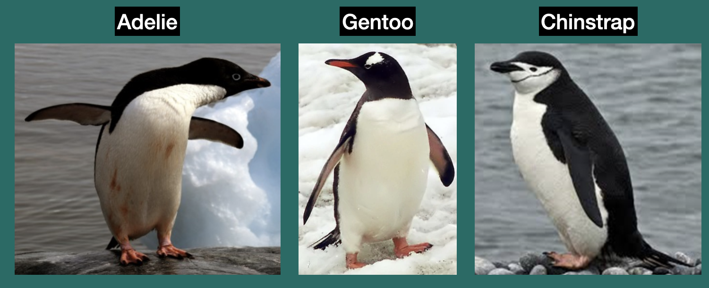
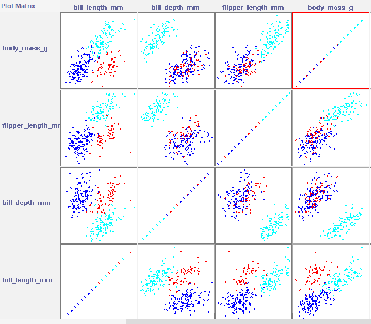
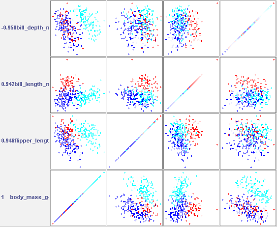
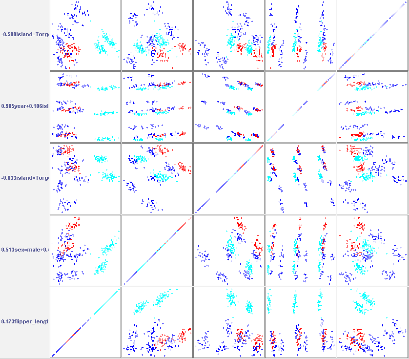

## Uzdevumi

1.  Atrodiet internetā kādu interesantu datu kopu apstrādei ar PCA.
2.  Aprakstiet, kā Jūs sapratāt šos datus.
3.  Vai, aplūkojot visas div-dimensiju projekcijas, varat uzreiz izsecināt, cik labus vai sliktus rezultātus uzrādīs PCA?
4.  Izmēģiniet centerData=true un false. Kāda sanāk rezultātu atšķirība?
5.  Iegūstiet ar PCA labākās datu projekcijas, un iekļaujiet to attēlus savā atbildē. Vai spējat pamanīt šajās bildēs kādas likumsakarības?
6.  Kas sanāk ar lineārajām atkarībām Jūsu datos?

## 1., 2. Izvēlētā datukopa

Šim uzdevumam es atkal izvēlos pingvīnu datukopu, bet šoreiz izmantosšu to pilnībā.

Datukopas apraksts ir no iepriekšējā uzdevuma:

Es izvēlējos R datu kopu `penguins` no pakotnes `{palmerpenguins}`. Tā satur mērījumus par pieaugušajiem pingvīniem, kas barojas ap Pālmera polārstaciju. Dati ietver informāciju par trīs pingvīnu sugām: Adélie, Chinstrap un Gentoo. Dati satur 344 ierakstus, un katrā ierakstā ir šāda informācija:

-   piederību sugai (`species`) (faktors, 3 līmeņi)
-   salu, kurā tas tika izmērīts (`island`) (faktors, 3 līmeņi)
-   knābja garumu milimetros (`bill length`)
-   knābja dziļumu milimetros (`bill depth`)
-   spārna garumu milimetros (`flipper length`)
-   ķermeņa masu gramos (`body mass`)
-   dzimumu (`sex`)
-   pētījuma gadu (`year`)


```{r dati, warning=FALSE, message=FALSE}
library(foreign)
library(palmerpenguins)
library(tidyverse)


pingvini <- penguins

pingvini_f <- pingvini %>%
  mutate(across(everything(),
                ~ if (is.numeric(.x)) .x else as.factor(.x)))

write.arff(pingvini_f, file = "pingvini_full.arff")
```


## Div-dimensiju projekcijas

"Dati skaidri grupējas pēc visiem nepārtrauktajiem mainīgajiem. Tādēļ es sagaidu, ka PCA analīze galvenokārt apstiprinās esošo grupējumu, iespējams, to nedaudz papildinot, piemēram, ņemot vērā dzimuma aspektu, bet tā neatklās neko būtiski jaunu.




## Ar datu centerData=true

Neiekopēšu rezultātus šeit, jo tas veidotu pārāk lielu bloku. 

Pirmā komponente izskaidro 0.99989 (99.989%) no kopējās variācijas (īpašvērtība = 639541.8131). Galvenie mainīgie šajā komponentē ir `body_mass_g` un `0.015 * flipper_length_mm`. Tas nozīmē, ka faktiski visa datu struktūra reducējas uz vienu asi, un pingvīnu izmērs (ķermeņa masa un spārnu garums) ir galvenais variācijas avots.

Otrā komponente izskaidro 0.00008 (0.008%) no kopējās variācijas, un tās īpašvērtība ir 51.30461. Galvenie mainīgie šajā komponentē ir `0.946*flipper_length_mm` + `0.308*bill_length_mm`. Iespējams, šī komponente apraksta sīkas morfoloģiskas atšķirības starp sugām.

**Secinājums**: No 9 sākotnējiem mainīgajiem tikai 2 (vai pat tikai 1) komponentes ir būtiskas.




## Ar centerData=false
Apskatot vizualizāciju, redzu, ka sugas ir skaidrāk nodalītas viena no otras, un dati papildus tiek sagrupēti apakšklasteros sugu ietvaros. Pieņemu, ka tas varētu būt saistīts ar dzimumu, jo tas ir iekļauts komponenti aprakstošo mainīgo sarakstā (lai gan ne pirmā pozīcijā), un parasti dažādiem dzimumiem pastāv vairāk vai mazāk izteiktas morfoloģiskas atšķirības (dzimumdimorfisms).

Šoreiz, vietā, lai izmantotu kovariances matricu, tika aprēķināta korelācijas matrica. Arī variācijas sadalījums starp galvenajām komponentēm mainījās.

Pirmā galvenā komponente izskaidro 0,41774 (41,77%) no kopējās variācijas, tās īpašvērība ir 3,75965. Galvenie mainīgie: `0.473 flipper_length_mm + 0.462 body_mass_g`. Šī komponente apraksta galveno morfometrisko dimensiju.

Otrā galvenā komponente izskaidro 0.18662 (18,66%) no variācijas, īpašvērtība = 1.67961. Galvenie mainīgie šajā komponentē ir `0.513 sex=male + 0.474 island=Dream`. Šī komponente, visticamāk, apraksta sekundāro variāciju, kas saistīta ar dzimumu un salas efektu.

Trešā galvenā komponente izskaidro 0,14952 (14,95%) no kopējās variācijas, tās īpašvērtība ir 1,34564. Galvenie mainīgie: `-0,633 island=Torgersen, -0,524 sex=male`.

Pirmās trīs galvenās komponentes kopā izskaidro 0,75388 (75,39%), bet pirmās piecas komponentes – 0,93684 (93,68%) no kopējās variācijas.




## 5. attēli

Attēlus no abiem variantiem es parādīju augstāk. Man vairāk patīk rezultāts, kas iegūts ar `centerData = FALSE`, jo, manuprāt, tas var atspoguļot dzimumu (šis mainīgais ir iekļauts komponentēs izmantoto mainīgo sarakstā), un tas būtu bioloģiski pamatoti. Vismaz vizuāli tas izskatās kā ļoti loģiska grupēšana. Sīkāk es šo aprakstīju iepriekšējās nodaļās.

Ņemot vērā, ka spārnu garumam un svaram ir atšķirīgi mērogi, it kā pareizi būtu izmantot tieši `centerData = TRUE`. Tomēr ar šo pieeju iegūtās vizualizācijas es neuzskatu par tik izsmeļošām. Jā, dažādu sugu pingvīniem pastāv izmēra atšķirības — divām sugām tās ir ļoti nozīmīgas, vienai sugas pārklājas ar pārējām, bet arī sugas ietvaros pastāv variācija, un beigās diapazoni pārklājas. Bez šaubām, svars ir noteicošs faktors sugu atšķirībai, taču, manuprāt, nav pareizi tik ļoti noliegt citus faktorus, kas var palielināt analīzes precizitāti un ņemt vērā nianses (piemēram, dzimumu).


## Kas sanāk ar lineārajām atkarībām Jūsu datos?

Pēc modeļa ar `centerData = TRUE`:

Pirmā komponente apraksta gandrīz visu variāciju, galvenokārt balstoties uz `body_mass_g, flipper_length_mm` un `bill_length_mm`. To var interpretēt kā dimensiju, kas atspoguļo galveno izmēra variāciju. Šai komponentē ir ļoti augsta īpašvērtība (639541.8131), un tā apraksta gandrīz visu variāciju (99.989%).

Otrā un trešā komponente izmanto `bill_length_mm, bill_depth_mm, flipper_length_mm` un `body_mass_g`, bet tām jau ir ievērojami mazāka īpašvērtība (attiecīgi 51.30461 un 16.03382), un tās apraksta tikai nelielu daļu no kopējās variācijas (0.008% un 0.003%). Tas liecina, ka `bill_length_mm, bill_depth_mm` un `flipper_length_mm` ir lineāri saistīti ar `body_mass_g`, jo šajās kombinācijās variācija praktiski nesniedz jaunu informāciju. Piemēram, lielāki pingvīni parasti ir arī ar garākiem spārniem un knābjiem, kas norāda uz lineāru saistību.

Kopumā novērojamas pozitīvas lineāras saistības starp ķermeņa daļu izmēriem un ķermeņa masu.

