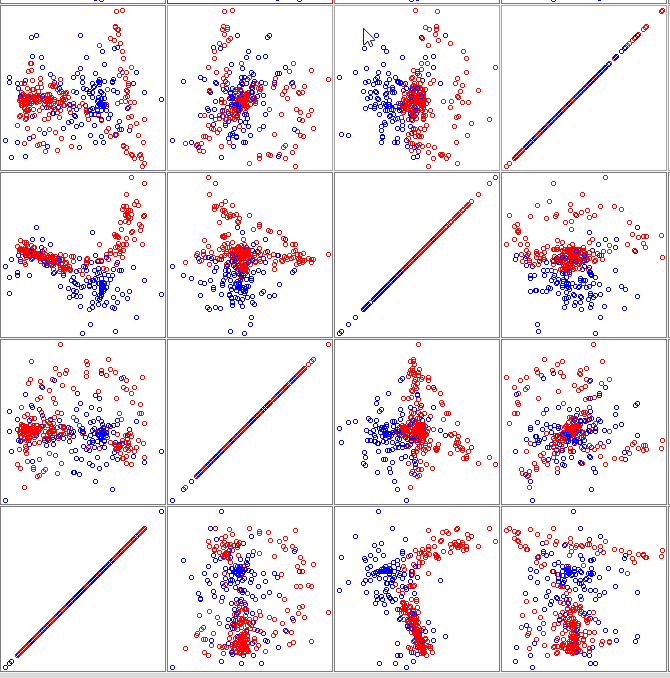

Cik tālu man izdevās saprast, TabPFN ir `Python` bibliotēka. Diemžēl man nav nekādas pieredzes ar `Python` valodu (esmu `R` lietotāja), un šobrīd neredzu iespējas to iemācīties, tāpēc izpildīšu iepriekšējā gada uzdevumu.

## Uzdevums

1.  Izmēģiniet lineāra klasifikatoru būvēšanu WEKA failam ionosphere, izmantojot SVM bez kernel funkcijas. a) Kādu labāko rezultātu ieguvāt? b) Kā saprotat iegūto diskriminanta izteiksmi? c) Vai datu kopas divdimensiju projekcijās vai PCA rezultātos varat saskatīt "spraugu", ko uzrāda SVM?

2.  Izmēģiniet klasifikatoru būvēšanu WEKA failam ionosphere izmantojot SVM ar dažādām kernel funkcijām. a) Ar kādu kernel funkciju ieguvāt labāko rezultātu? b) Kā saprotat iegūto diskriminanta izteiksmi? Cik vērtīga tā Jums liekas? Kāds ir tās lielākais tŗūkums?

## Dati

Tika izmantota `ionosphere` datu kopa, kas satur ar radaru iegūtus signālus no jonosfēras. Signāli ir klasificēti divās grupās: “good” – tie, kas norāda uz reālu objektu, un “bad” – tie, kas satur tikai troksni. Kopā ir 351 novērojums ar 34 skaitliskiem mainīgajiem un bināru klasi (“good” – 225 ieraksti, “bad” – 126 ieraksti).

## 1. SVM bez kernel funkcijas

#### Bez normālizēšanas/ standartizēšanas

Izmantotie iestādījumi:

-   c = 1;
-   filterType = `No normalization/ standartization`;
-   kernel = PolyKernel (exponent = 1).

Izmantotā testa veids: 10 foldu korss-validācija.

**Rezultāti:**

```         
Time taken to build model: 0.03 seconds

=== Stratified cross-validation ===
=== Summary ===

Correctly Classified Instances         309               88.0342 %
Incorrectly Classified Instances        42               11.9658 %
Kappa statistic                          0.7286
Mean absolute error                      0.1197
Root mean squared error                  0.3459
Relative absolute error                 25.9836 %
Root relative squared error             72.1043 %
Total Number of Instances              351     
```

Klasifikātors pareizi noteica objekta klasi 88,03 % gadījumu, kas ir 309 no 351 objekta. Nepareizi noteikti bija 42 objekti (11,97 %). Kappa statistika (Cohen's kappa – rādītājs, kas novērtē saskaņu starp klasifikātora prognozēm un faktiski eksistējošajām klasēm, izslēdzot nejaušību) šajā gadījumā ir 0,729, kas liecina par labu saskaņu starp prognozi un faktisko klasi. Vidējās absolūtās kļūdas vērtība ir samērā zema (0,12), bet kvadrātsakne no vidējās kvadrātiskās kļūdas ir 0,346, kas, manuprāt, tomēr ir nedaudz liela, jo lielas kļūdas tiek sodītas stingrāk.

```         
=== Detailed Accuracy By Class ===

                 TP Rate  FP Rate  Precision  Recall   F-Measure  MCC      ROC Area  PRC Area  Class
                 0,738    0,040    0,912      0,738    0,816      0,738    0,849     0,767     b
                 0,960    0,262    0,867      0,960    0,911      0,738    0,849     0,858     g
Weighted Avg.    0,880    0,182    0,883      0,880    0,877      0,738    0,849     0,826     
       
=== Confusion Matrix ===

   a   b   <-- classified as
  93  33 |   a = b
   9 216 |   b = g
```

Klasifikators ir ļoti precīzs attiecībā uz klasi "b", jeb "sliktajiem" signāliem (0,912), kas nozīmē, ka no visiem gadījumiem, kurus klasifikators noteica kā "b", 91,2% gadījumu tas bija pareizs.

Tomēr tas atrod tikai 73,8 % no visiem "b" gadījumiem. Pārējos 33 gadījumus modelis palaida garām un nepareizi klasificēja kā "g", jeb "labu" signālu. Tas nozīmē, ka modelis, prognozējot piederību "b" klasei, ir ļoti piesardzīgs, un, kad tas to dara, rezultāts ir ļoti precīzs, bet tas neatrod visus "sliktos" gadījumus.

Savukārt "g" klasi klasifikators atrod gandrīz vienmēr (96,0 %), bet viltus pozitīvo rezultātu īpatsvars ir augstāks (0,262).

**secinājums:** Klasifikatoram ir tendence kļūdīties, klasificējot patieso "b" klasi kā "g" klasi (33 gadījumi), nekā otrādi – klasificējot patieso "g" kā "b" klasi (9 gadījumi). Tas nozīmē, ka modelis labāk klasificē biežāko klasi (labs signāls), bet retāk sastopamos gadījumus – sliktāk (slikta signāla gadījumi).

#### Ar normalizāciju

Tiek izmantoti tie paši iestatījumi, izņemot treniņa datu normalizāciju.

**Rezultāti:**

```         
Time taken to build model: 0.01 seconds

=== Stratified cross-validation ===
=== Summary ===

Correctly Classified Instances         311               88.604  %
Incorrectly Classified Instances        40               11.396  %
Kappa statistic                          0.7406
Mean absolute error                      0.114 
Root mean squared error                  0.3376
Relative absolute error                 24.7463 %
Root relative squared error             70.3666 %
Total Number of Instances              351     
```

Šim modelim izpildes laiks ir par 0,02 sekundēm īsāks nekā iepriekšējam.

```         
=== Detailed Accuracy By Class ===

                 TP Rate  FP Rate  Precision  Recall   F-Measure  MCC      ROC Area  PRC Area  Class
                 0,738    0,031    0,930      0,738    0,823      0,751    0,853     0,780     b
                 0,969    0,262    0,869      0,969    0,916      0,751    0,853     0,861     g
Weighted Avg.    0,886    0,179    0,891      0,886    0,883      0,751    0,853     0,832     

=== Confusion Matrix ===

   a   b   <-- classified as
  93  33 |   a = b
   7 218 |   b = g
```

Ar šo modeli iegūtie rezultāti nedaudz atšķiras no iepriekšējā modeļa. SVM aprēķini balstās uz attālumu starp datu punktiem, un, ja atribūtiem ir ļoti atšķirīgi mērogi, tas var radīt problēmas. Atribūtiem ar lielāku vērtību diapazonu (piemēram, no 0 līdz 100) ir dominējoša ietekme uz attāluma aprēķinu un tādējādi uz atdalošās hiperplaknes atrašanu, salīdzinot ar atribūtiem ar mazu diapazonu (piemēram, no 0 līdz 1). Tomēr, apskatot oriģinālo datu tabulu, es pamanīju, ka gandrīz visas atribūtu vērtības ir robežās starp -1.0 un 1.0, un daudzi gadījumi satur 0.0 vērtības, kas norāda uz centrālo punktu. Tādēļ man ir aizdomas, ka dati jau sākotnēji bija pārveidoti.

Bet kopumā papildus normalizācija uzlaboja modeļa vispārējo sniegumu (no 88,03 % uz 88,60 %). Modelis ir kļuvis uzticamāks (Kappa statistika iepriekšējā modelī bija 0,7286, bet šajā – 0,7406). Papildus tam normalizācija samazināja viltus pozitīvo rezultātu skaitu (kad "g" tiek klasificēts kā "b") no 9 uz 7.

#### Ar standartizāciju

Visi pārējie iestatījumi ir palikuši tādi paši, izņemot standartizēšanu.

**Rezultāti:**

```         
Time taken to build model: 0.02 seconds

=== Stratified cross-validation ===
=== Summary ===

Correctly Classified Instances         311               88.604  %
Incorrectly Classified Instances        40               11.396  %
Kappa statistic                          0.7434
Mean absolute error                      0.114 
Root mean squared error                  0.3376
Relative absolute error                 24.7463 %
Root relative squared error             70.3666 %
Total Number of Instances              351     
```

Izpildes laiks ir par vienu sekundes simtdaļu garāks nekā modelī ar treniņa kopas datu normalizāciju, un tikpat ātrs kā modelis bez standartizācijas vai normalizācijas.

```         
=== Detailed Accuracy By Class ===

                 TP Rate  FP Rate  Precision  Recall   F-Measure  MCC      ROC Area  PRC Area  Class
                 0,762    0,044    0,906      0,762    0,828      0,750    0,859     0,775     b
                 0,956    0,238    0,878      0,956    0,915      0,750    0,859     0,867     g
Weighted Avg.    0,886    0,169    0,888      0,886    0,884      0,750    0,859     0,834     

=== Confusion Matrix ===

   a   b   <-- classified as
  96  30 |   a = b
  10 215 |   b = g
```

Kopējā modeļa precizitāte ir palikusi tāda pati kā modelī ar normalizāciju, tomēr kļūdu sadalījums starp klasēm ir mainījies. Modelī ar standartizāciju samazinājies viltus negatīvo rezultātu skaits par 3 gadījumiem, kad klase "b" tika nepamatoti palaista garām, bet vienlaikus palielinājies viltus pozitīvo rezultātu skaits par 3 gadījumiem, kad klase "g" tika kļūdaini klasificēta kā klase "b".

### 1.a Labākais rezultāts

Balstoties uz metriku rezultātiem, labākais šķiet trešais modelis ar standartizāciju. Tomēr, ņemot vērā, ka kļūdu sadalījums un citi rādītāji atšķiras starp modeļiem, pētniekiem varētu būt interesanti fokusēties uz kļūdu novēršanu konkrētā rezultātā. Ja mūs interesē pēc iespējas mazāk palaist garām labu signālu jeb “g” klasi, tad labākais izvēle būtu otrais modelis ar normalizēšanu, jo tas visefektīvāk nosaka labu signālu, palaidot garām tikai 7 no 225 patiesajiem “g” gadījumiem.

### 1.b diskriminanta izteiksme

Tā kā man izveidotais modelis (otrais modelis ar normalizēšanu) izmanto lineāru kodolu, diskriminanta izteiksme tiek definēta kā visu atribūtu svērtā summa, mīnus brīvais loceklis.

```         
Machine linear: showing attribute weights, not support vectors.

         2.7284 * (normalized) a01 + 1.2922 * (normalized) a03 + 0.496 * (normalized) a04 + 1.25 * (normalized) a05 + 1.0747 * (normalized) a06 + 1.3562 * (normalized) a07 + 1.7094 * (normalized) a08 + 0.662 * (normalized) a09 + 0.3239 * (normalized) a10 + -0.3074 * (normalized) a11 + -0.2181 * (normalized) a12 + -0.3015 * (normalized) a13 + 0.5468 * (normalized) a14 + 0.5205 * (normalized) a15 + -0.3385 * (normalized) a16 + 0.1632 * (normalized) a17 + 0.1591 * (normalized) a18 + -0.3796 * (normalized) a19 + 0.0701 * (normalized) a20 + 0.2769 * (normalized) a21 + -1.6155 * (normalized) a22 + 0.9716 * (normalized) a23 + 0.2532 * (normalized) a24 + 0.5938 * (normalized) a25 + 0.4138 * (normalized) a26 + -1.5804 * (normalized) a27 + 0.1973 * (normalized) a28 + 0.2796 * (normalized) a29 + 1.1746 * (normalized) a30 + 0.698  * (normalized) a31 + -0.3987 * (normalized) a32 + -0.2987 * (normalized) a33 + -1.1094 * (normalized) a34 -  7.5956
```

Šī izteiksme parāda lineāro robežu, ar kuru modelis atdala klases "b" un "g" atbilstoši mainīgo vērtībām. Koeficienti pie katra atribūta norāda, cik lielā mērā šis mainīgais ietekmē piederību kādai no klasēm — pozitīvas vērtības palielina varbūtību, ka novērojums pieder klasei “b”, bet negatīvas — ka klasei “g”.

### 1.c PCA rezultāti

Nē. Ne datu divdimensiju projekcijā, ne PCA rezultātos es neredzu plaisu, kas ļautu pilnībā atdalīt datu kopas — vienmēr kaut kas paliek. Tomēr ir vairākas vietas, kur grupu var atdalīt ar diezgan mazu kļūdu skaitu, kas arī notika manā modelī.

PCA rezultāti:



## 2. SVM ar dažādām kernel funkcijām

### PolyKernel, exponent = 2

Visi iestatījumi ir tādi paši kā modelī ar normalizāciju, bet `exponent = 2`.

```         
Time taken to build model: 0.01 seconds

=== Stratified cross-validation ===
=== Summary ===

Correctly Classified Instances         318               90.5983 %
Incorrectly Classified Instances        33                9.4017 %
Kappa statistic                          0.7879
Mean absolute error                      0.094 
Root mean squared error                  0.3066
Relative absolute error                 20.4157 %
Root relative squared error             63.9136 %
Total Number of Instances              351     
```

Šim modelim ir lielāka veiktspēja nekā pirmajā uzdevumā izvēlētajam labākajam modelim: 90,60 % jeb 318 no 351 objekta ir pareizi klasificēti šajā modelī, salīdzinot ar 88,60 % (311 no 351) iepriekšējā. Kappa statistika arī ir palielinājusies no 0,740 līdz 0,788, savukārt absolūtā kļūda nedaudz samazinājusies no 0,338 līdz 0,307.

```         
=== Detailed Accuracy By Class ===

                 TP Rate  FP Rate  Precision  Recall   F-Measure  MCC      ROC Area  PRC Area  Class
                 0,786    0,027    0,943      0,786    0,857      0,795    0,880     0,818     b
                 0,973    0,214    0,890      0,973    0,930      0,795    0,880     0,884     g
Weighted Avg.    0,906    0,147    0,909      0,906    0,904      0,795    0,880     0,860     

=== Confusion Matrix ===

   a   b   <-- classified as
  99  27 |   a = b
   6 219 |   b = g
```

Polinomiālais modelis labāk atdala klases: klases "b" precizitāte (precision) palielinās no 0.930 uz 0.943, un atpazīšana (recall) no 0.738 uz 0.786. Arī attiecībā uz klasi "g" precizitātes rādītāji uzlabojas: precizitāte no 0.869 uz 0.890 un atpazīšana no 0.969 uz 0.973.

**Secinājums:** Otras pakāpes polinomiālais modelis ir labāks par lineāro modeli, īpaši attiecībā uz klases "b" noteikšanu. Visticamāk, tas saistīts ar to, ka jonosfēras datu klases nav pilnībā lineāri atdalāmas.


### PolyKernel, exponent = 5

Visi iestatījumi ir tādi paši kā modelī ar normalizāciju, bet `exponent = 5`.

```         
Time taken to build model: 0.15 seconds

=== Stratified cross-validation ===
=== Summary ===

Correctly Classified Instances         302               86.0399 %
Incorrectly Classified Instances        49               13.9601 %
Kappa statistic                          0.6874
Mean absolute error                      0.1396
Root mean squared error                  0.3736
Relative absolute error                 30.3142 %
Root relative squared error             77.8815 %
Total Number of Instances              351     
```

Modeļa izveides laiks ievērojami palielinās, un nepareizi klasificēto punktu skaits ir būtiski pieaudzis.

```         
=== Detailed Accuracy By Class ===

                 TP Rate  FP Rate  Precision  Recall   F-Measure  MCC      ROC Area  PRC Area  Class
                 0,738    0,071    0,853      0,738    0,791      0,691    0,833     0,724     b
                 0,929    0,262    0,864      0,929    0,895      0,691    0,833     0,848     g
Weighted Avg.    0,860    0,193    0,860      0,860    0,858      0,691    0,833     0,803     

=== Confusion Matrix ===

   a   b   <-- classified as
  93  33 |   a = b
  16 209 |   b = g
```

**Secinājums:** Izmaiņas precizitātes metriku vērtībās norāda, ka šis modelis datus apraksta sliktāk nekā iepriekšējais. Šajā modelī tika izmantots piektās pakāpes polinomiālais kodols, kas ievērojami palielina modeļa nelinearitāti. Ņemot vērā, ka datu kopā ir tikai 351 gadījums, šāda sarežģīta funkcija var būt pārmērīgi elastīga, jo tai piemīt zemāka vispārināmība kross-validācijas rezultātos.

### PUK Kernel

Izvēlētais kodola veids: `PUK`, iekšējie iestatījumi ir pēc noklusējuma. Pārējie iestatījumi nav mainījušies.

```         
Time taken to build model: 0.04 seconds

=== Stratified cross-validation ===
=== Summary ===

Correctly Classified Instances         330               94.0171 %
Incorrectly Classified Instances        21                5.9829 %
Kappa statistic                          0.8702
Mean absolute error                      0.0598
Root mean squared error                  0.2446
Relative absolute error                 12.9918 %
Root relative squared error             50.9854 %
Total Number of Instances              351     
```

Uz doto brīdi pēc pareizi klasificēto punktu skaita tas ir labākais rezultāts. Puk kodols ir samazinājis kopējo kļūdu skaitu līdz 21 (salīdzinot ar 33 un 40 iepriekš), un tā Kappa (0.8702) un ROC laukums (0.936) norāda uz izcilu klasifikācijas spēju, kas ir tuvu perfektai.

```         
=== Detailed Accuracy By Class ===

                 TP Rate  FP Rate  Precision  Recall   F-Measure  MCC      ROC Area  PRC Area  Class
                 0,921    0,049    0,913      0,921    0,917      0,870    0,936     0,869     b
                 0,951    0,079    0,955      0,951    0,953      0,870    0,936     0,940     g
Weighted Avg.    0,940    0,068    0,940      0,940    0,940      0,870    0,936     0,915     

=== Confusion Matrix ===

   a   b   <-- classified as
 116  10 |   a = b
  11 214 |   b = g
```

Ar šo modeli mēs nonācām pie kompromisa precizitātes ziņā:

Labo signālu jeb "g" klases atpazīšana otrās pakāpes polinomu modelī bija nedaudz labāka, jo neatpazīto signālu skaits bija 6, salīdzinot ar 11 šajā modelī. 

Savukārt attiecībā uz sliktajiem signāliem jeb "b" klasi otrās pakāpes polinoma modelis darbojās daudz sliktāk, jo palaida garām 27 signālus. Šajā modelī mēs sasniedzām ievērojamu uzlabojumu – tikai 10 "b" klases gadījumi tika palaisti garām.

### 2.a Labākais rezultats

Labākais rezultāts tika sasniegts ar PUK Kernel modeli. Tas ir ļoti elastīgs modeļu tips, un šie labi rezultāti liecina, ka atdalošā robeža starp "b" un "g" klasēm ir ļoti sarežģīta un nelineāra. Atbalstošo vektoru skaits šim modelim ir 221 (kopējais novērojumu skaits ir 351), kas noved pie ārkārtīgi garas diskriminanta izteiksmes. Tik liels atbalstošo vektoru skaits bieži var liecināt par pārpielāgošanos, tomēr krosvalidācijā iegūtā 94% precizitāte norāda uz pretējo.

### 2.b diskriminanta izteiksme

Diskriminanta izteiksme ir ļoti gara, jo tajā iesaistīti 221 punkti. Daļēji atbilde uz šo jautājumu jau sniegta, atbildot uz jautājumu 2.a. Tas, ka robeža balstās uz 221 datu punktu, lai definētu to precīzo, izliekto formu, norāda uz to, ka robeža starp klasēm ir ļoti sarežģīta un ka tās daļēji pārklājas savā starpā.

Tās lielākais trūkums ir pilnīgs interpretējamības zudums. Modelis kļuva līdzīgs “black-box” modeļiem. Mēs vairs nevaram tieši noteikt, kuri no sākotnējiem atribūtiem visvairāk ietekmē lēmuma robežas novilkšanu. Atribūta ietekme ir izkliedēta sarežģītā izteiksmē, kurā iesaistīti 221 atbalsta vektoru kombinācijas.
