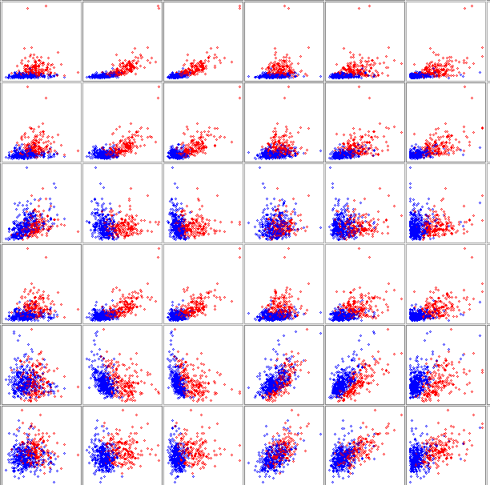
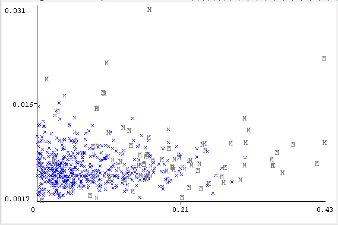
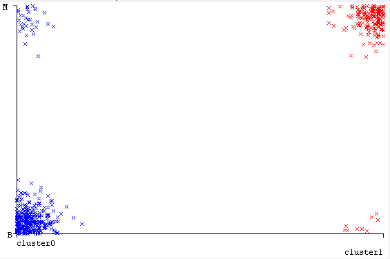

## Uzdevums

1.  Atrodiet internetā kādu interesantu datu kopu klaterizācijas uzdevumam. Mēģiniet atrisināt šo uzdevumu, izmantojot:
2.  Kādu no Jums ērtāk pieejamām DBSCAN (labāk HDBSCAN) realizācijām (WEKA, scikit vai citu). Kādu rezultātu ieguvāt?
3.  Kādu no Jums ērtāk pieejamām K-means realizācijām (WEKA, scikit vai citu). Kādu rezultātu ieguvāt?

```{r bibliotekas, message=FALSE, warning=FALSE}
library(readxl)
library(dplyr)
library(foreign)
```

## 1. Izmantotie dati

Šajā uzdevumā es izmantoju brīvi pieejamo datu kopu "Breast Cancer Wisconsin (Diagnostic)" ([avots](https://archive.ics.uci.edu/dataset/17/breast+cancer+wisconsin+diagnostic)). Šie dati iegūti no krūts audzēju biopsiju digitāliem attēliem, kuros automātiski aprēķinātas šūnu kodolu ģeometriskās un tekstūras īpašības. Datu kopā ir 569 novērojumi un 10 parametri, kas raksturo kodolu rādiusu, tekstūru, perimetru, laukumu, gludumu, kompaktumu, izliekumu, izliekuma punktu skaitu, simetriju un fraktālo dimensiju. Katrs parametrs aprēķināts trīs veidos — kā vidējā vērtība, standarta kļūda un sliktākā vērtība — kopā veidojot 30 pazīmju kolonnes. Papildus ir divas kolonnas: ID un diagnostiskais rezultāts, kas norāda datu klasi (B – labdabīgs audzējs, M – ļaundabīgs).

Datu sagatavošanai izmantotais R kods:

```{r dati}
cancer <- read.csv("wdbc.data", header = FALSE)
names <-  c("ID", "Diagnosis", "radius1", "texture1", "perimeter1", "area1",
            "smoothness1", "compactness1", "concavity1", "concave_points1", "symmetry1",
            "fractal_dimension1", "radius2", "texture2", "perimeter2", "area2", "smoothness2",
            "compactness2", "concavity2", "concave_points2", "symmetry2", "fractal_dimension2",
            "radius3", "texture3", "perimeter3", "area3", "smoothness3", "compactness3",
            "concavity3", "concave_points3", "symmetry3", "fractal_dimension3")

colnames(cancer) <- names 

cancer_f <- cancer %>%
  mutate(across(everything(), as.character)) %>%   
  mutate(across(everything(), ~na_if(.x, "?"))) %>%  
  mutate(across(everything(),
                ~ if (suppressWarnings(!any(is.na(as.numeric(.x))))) as.numeric(.x) else as.factor(.x)))

write.arff(cancer_f, file = "cancer_f.arff")
```

WEKA divdimensiju izkliedes attēlos grupas nekur nav pilnīgi nošķirtas, tomēr lielākā to daļa ir diezgan labi atdalītas (katra koncentrējas savā mākoņa pusē), un pārklājas tikai neliela daļa novērojumu no abām grupām.



Manuprāt, izvēlētajos datos diagnožu klasteriem blīvums nav vienāds: izkliedes attēlos ļaundabīgās klases novērojumiem ir lielāka izkliede, kas var traucēt analīzei, jo DBSCAN algoritms izmanto vienu kopīgu epsilon un minPts vērtību, kas var nebūt piemērota visiem klasteriem.

## 2. DBSCAN

Es izmantoju DBSCAN algoritmu no papildu WEKA pakotnes “optics_dbScan”.

Izmantotie iestatījumi:

-   debug = `False`;
-   distanceFunction = `EuclideanDistance`;
    -   dontNormalize = `False`;
-   epsilon = `0.9`;
-   minPoints = `6`.

Cluster mode = `Use training set`

Es liku algoritmam ignorēt kolonnas "ID", "Diagnosis".

Iegūtie rezultāti:

```         

Time taken to build model (full training data) : 0.05 seconds

=== Model and evaluation on training set ===

Clustered Instances

0      560 (100%)

Unclustered instances : 9
```

DBSCAN algoritms izveidoja vienu klasteri ar 560 punktiem, savukārt 9 punkti tika klasificēti kā troksnis. 

Es pamēģināju vairākas reizes, mainot `epsilon` un `minPts` estatījumus, taču man neizdevās iegūt divus klasterus — mainījās tikai punktu skaits, ko algoritms klasificēja kā troksni. 

Manos datos klašu mākoņi nebija pilnībā atdalīti un nedaudz pārklājās pa vidu, veidojot lielo mākoni, kur no vienas puses ir klase "M", no otras — klase "B", bet pa vidu abas klases bija kopā. Manuprāt, tieši šis aspekts bija iemesls neveiksmīgajai klasifikācijai. DBSCAN veido klasterus pēc punktu blīvuma, un, ja dažiem punktiem centrālajā zonā `eps` rādiuss pieskaras punktiem gan no vienas, gan otras klases, algoritms tos interpretē kā vienu kopēju blīvu reģionu.

**Secinājums:** DBSCAN algoritms nav piemērots izvēlēto datu klasifikācijai, jo tas labāk darbojas datu kopās, kur klases ir pilnībā atdalītas viena no otras.

## 3. K-means

Izmantotie iestatījumi:

-   seed = `10`
-   numClusters = `2`
-   maxIterations = `500`
-   initializationMethod = `Random`
-   distanceFunction = `EuclideanDistance`

Cluster mode = `Use training set`

Es liku algoritmam ignorēt kolonnas "ID", "Diagnosis".

```         
kMeans
======

Number of iterations: 7
Within cluster sum of squared errors: 214.6886214878955

Time taken to build model (full training data) : 0 seconds

=== Model and evaluation on training set ===


Final cluster centroids:
                                Cluster#
Attribute            Full Data         0         1
                       (569.0)   (380.0)   (189.0)
==================================================
radius1                14.1205   12.3764   17.6459
texture1               19.3053   18.2361   21.4666
perimeter1             91.9148   79.5282  116.9514
area1                 654.2798  482.7058 1001.0782
smoothness1             0.0963    0.0922    0.1046
compactness1             0.104    0.0781    0.1564
concavity1              0.0884    0.0442    0.1779
concave_points1         0.0487    0.0263    0.0941
symmetry1               0.1811    0.1733    0.1966
fractal_dimension1      0.0628    0.0621    0.0641
radius2                  0.404     0.289    0.6363
texture2                1.2174    1.2128    1.2267
perimeter2               2.856    2.0252    4.5352
area2                   40.138   22.1685   76.4594
smoothness2              0.007    0.0071     0.007
compactness2            0.0254    0.0199    0.0367
concavity2              0.0319    0.0231    0.0496
concave_points2         0.0118    0.0095    0.0163
symmetry2               0.0205    0.0201    0.0213
fractal_dimension2      0.0038    0.0033    0.0047
radius3                16.2531   13.6993   21.4152
texture3               25.6919   24.0523   29.0061
perimeter3            107.1251   89.0463  143.6672
area3                 878.5789  589.7789 1462.3234
smoothness3             0.1323    0.1252    0.1466
compactness3            0.2535    0.1806     0.401
concavity3              0.2714    0.1645    0.4874
concave_points3         0.1143    0.0763    0.1912
symmetry3               0.2898    0.2713     0.327
fractal_dimension3      0.0839    0.0786    0.0946

Clustered Instances

0      380 ( 67%)
1      189 ( 33%)
```

Algoritms ir izveidojis divus klasterus:

-   Klasters 0 ar 380 gadījumiem (67% no novērojumiem)\

-   Klasters 1 ar 189 gadījumiem (33% no novērojumiem)

Analizējot klastera centru vērtības, var identificēt galvenās atšķirības starp abām grupām. Piemēram, ļaundabīgiem audzējiem parasti ir lielāks radiuss, perimetrs un izliekums. Klasteris 0 atspoguļo šūnu kodolus ar zemākām vidējām vērtībām visos kritiskajos morfoloģiskajos atribūtos. Tā kā šie parametri krūts vēža datos parasti ir saistīti ar audzēja labdabīgumu, ir ticams, ka šis klasteris galvenokārt sastāv no labdabīgu audzēju gadījumiem. Savukārt, klasteris 1 atspoguļo šūnu kodolus ar augstākām vidējām vērtībām visās kritiskajās pazīmēs, tādēļ tas, visticamāk, sastāv no ļaundabīgu audzēju gadījumiem.

Apskatot izkliedes attēlu ar klasteru numuriem pret datu klasēm, redzams, ka algoritms lielākoties klasificējis datus pareizi, tomēr dažos gadījumos tas kļūdījies, klasificējot ļaundabīga audzēja šūnu kodolus kā labdabīgas un otrādi. Priecē tas, ka nepareizi klasificēto ļaundabīgo šūnu ir mazāk nekā nepareizi klasificēto labdabīgo šūnu.



Neredzu iemeslu mēģināt analīzi ar lielāku klasteru skaitu, jo datos no paša sākuma pastāvēja tikai divas grupas.

Atšķirības, kas iegūtas starp abām metodēm, rodas no atšķirīgajām pieejām. K-means algoritmam nepieciešamais klasteru skaits tiek mākslīgi noteikts pirms analīzes veikšanas. Pēc tam algoritms sadala datus noteiktajā klasteru skaitā, meklējot centroidus un piešķirot katru punktu tam, kuram centroidam tas ir tuvāk attāluma ziņā. Tāpēc pat nedaudz pārklājošies mākoņi var tikt sadalīti divos klasteros. Manis izvēlētajos datos k-means algoritms gandrīz veiksmīgi nodalīja grupas, jo tās atrodas dažādās “kopējā” mākoņa daļās.

**Secinājums:** K-means pieeja izrādās piemērota izvēlētajiem datiem; analīzes algoritms jāizvēlas atbilstoši konkrēto datu specifikai.
