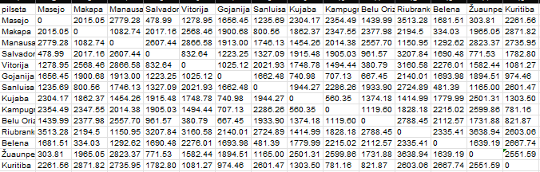

## Uzdevums:

1. Izvēlieties kādu valsti, kuras nosaukums sākas ar Jūsu pirmā uzvārda pirmo burtu (Austrālija nederēs, bet Latvija derēs);
2. Sameklējiet datus par šīs valsts vismaz astoņu pilsētu savstarpējiem attālumiem;
3. Izmantojot kādu no MDS realizācijām, "uzģenerējiet" aptuvenu šīs valsts karti. Atskaitē parādiet visas savas darbības/skriptus/pirmkodus un procesā iegūtos attēlus.


## 1. uzdevums

Es izvēlējos Brazīliju un ņēmu attālumus starp 14 štatu administratīvajiem centriem (informācijas [avots](https://lv.wikipedia.org/wiki/Braz%C4%ABlijas_%C5%A1tati)), tas ir pilsētas: Masejo, Makapa, Manausa, Salvadora, Vitorija, Gojanija, Sanluisa, Kujaba, Kampugrandi, Belu Orizonti, Riubranku, Belena, Žuaunpesoa, Kuritiba.


## 2. uzdevums

Lai noteiktu precīzu attālumu starp pilsētām (koordinātas ņemtas no katras pilsētas Wikipedia lapas), es izmantoju interneta vietni https://www.distance.to/ .

Punktu koordinātas:

1. Masejo: 9°40′S 35°44′W;
2. Makapa: 0°2′2″S 51°3′59″W;
3. Manausa: 03°06′0″S 60°01′0″W;
4. Salvadora: 13°00′S 38°31′W;
5. Vitorija: 20°17′20″S 40°18′30″W;
6. Gojanija: 16°40′S 49°15′W;
7. Sanluisa: 2°31′42″S 44°18′16″W;
8. Kujaba: 15°35′45″S 56°05′49″W;
9. Kampugrandi: 20°26′37″S 54°38′52″W;
10. Belu Orizonti: 19°55′S 43°56′W;
11. Riubranku: 9°58′29″S 67°48′36″W;
12. Belena: 1°27′S 48°30′W;
13. Žuaunpesoa: 07°05′00″S 34°50′00″W;
14. Kuritiba: 25°25′47″S 49°16′19″W.

Man izveidojās šāda tabula:



## 3. uzdevums

Es esmu R lietotāja. 

Sagatavoju matricu: noņēmu kolonnu ar pilsētu nosaukumiem, likvidēju liekās atstarpes, pārveidoju skaitļus par numeric tipu un beigās matricu pārvēršu par distances objektu.

```{r datu_sagatavosana, warning=FALSE, message=FALSE}
library(readxl)
library(dplyr)

dist_dati <- read_excel("dati.xlsx")

rindu_nosaukumi <- dist_dati$pilseta

dist_num <- dist_dati[, -1]

dist_num <- dist_num %>%
  mutate(across(everything(), ~as.numeric(gsub("[^0-9\\.]", "", .))))

dist_matrica <- as.matrix(dist_num)


rownames(dist_matrica) <- rindu_nosaukumi
colnames(dist_matrica) <- colnames(dist_num)

dist_matrica <- as.dist(dist_matrica)
```


Veicu daudzdimensiju skalēšanu (MDS) un vizualizēju rezultātus:

```{r mds, warning=FALSE, message=FALSE}
library(ggplot2)
library(ggrepel)

mds_rezultats <- cmdscale(dist_matrica, k = 2)

mds_df <- as.data.frame(mds_rezultats)
colnames(mds_df) <- c("MD1", "MD2")
mds_df$Pilseta <- rindu_nosaukumi


ggplot(mds_df, aes(x = MD1, y = MD2, label = Pilseta)) +
  geom_point(size = 4, shape = 10) + 
  geom_text(vjust = -1, hjust = 0.5) + 
  labs(x = "MDS Dimensija 1", y = "MDS Dimensija 2") +
  theme_classic() +
  coord_fixed(ratio = 1) +
  xlim(min(mds_df$MD1) - 200, max(mds_df$MD1) + 200) +
  ylim(min(mds_df$MD2) - 200, max(mds_df$MD2) + 200) +
  theme(
        axis.title.x = element_text(size = 15, face = "bold"),
        axis.title.y = element_text(size = 15, face = "bold")
    )
```

Kopumā izvietojums ir atbilstošs, taču, lai atkārtotu izvietojumu kartē, nepieciešams atspoguļot punktu izvietojumu pa y asi: 

```{r atspogulot}
ggplot(mds_df, aes(x = MD1, y = -MD2, label = Pilseta)) +
  geom_point(size = 4, shape = 10) + 
  geom_text_repel() + 
  labs(x = "MDS Dimensija 1", y = "MDS Dimensija 2") +
  theme_classic() +
  coord_fixed(ratio = 1) +
  xlim(min(mds_df$MD1) - 500, max(mds_df$MD1) + 800) +
  ylim(min(mds_df$MD2) - 500, max(mds_df$MD2) + 500) +
  theme(
        axis.title.x = element_text(size = 15, face = "bold"),
        axis.title.y = element_text(size = 15, face = "bold"))
```

Iegūtais izvietojums ir pietiekami tuvs reālajam. Nepareizi izvietotu punktu nav, un "Kurzemes defekts" nav novērojams.

MDS metode veiksmīgi izvietoja 14 Brazīlijas pilsētas divdimensiju telpā, tā, lai attālums starp punktiem diagrammā atspoguļotu sākotnējo attālumu matricu.

**Secinājums:** MDS metode spēj transformēt attālumu matricu saprotamā ģeogrāfiskā attēlā ar minimāliem izkropļojumiem.


