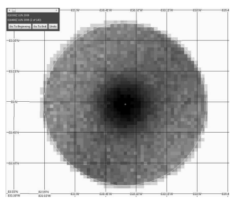
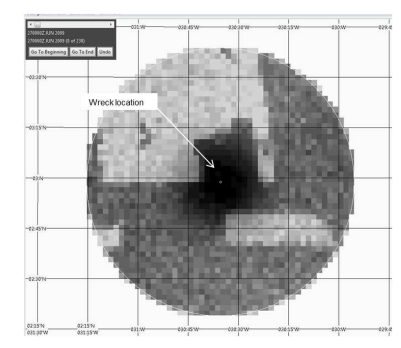

## Uzdevums

1. Atrodiet internetā (vai lieciet to izdarīt Jūsu MI) kādu veiksmes stāstu, kurā ar Beijesa estimācijas palīdzību uzdevuma risināšanā ir izmantotas būtiskas iepriekšējās zināšanas. Apmēram tā, kā lekcijās stāstīju par slimnīcas S letalitātes rādītāju 7,5%. 
2. Aprakstiet visu tā, lai es varētu saprast.

## Raksts

Es izvēlējos rakstu “Search for the Wreckage of Air France Flight AF 447” (Stone et al., 2014), kurā aprakstīts gadījums, kad Baijesa teorija tika pielietota nokritušas lidmašīnas meklēšanā.

### Notikums

2009. gada 1. jūnijā aviokompānijas Air France lidmašīna Airbus A330, veicot reisu no Riodežaneiro uz Parīzi, pazuda virs Atlantijas okeāna ar 228 cilvēkiem uz borta. Lidmašīna pazuda pēkšņi, neraidot trauksmes signālus, tādēļ sākotnējā informācija par tās atrašanās vietu bija ļoti ierobežota.

### Iepriekšējās zināšanas (Prior)

Šajā rakstā Prior sadalījums tiek veidots, balstoties uz:

- pēdējo zināmo pozīciju,

- vēsturiskajām zināšanām par to, cik tālu lidmašīnas parasti nogrimst pēc tehniska bojājuma,

- zināšanām par līdojuma dinamiku (modeļiem, kas rāda, cik tālu lidmašīna varētu būt aizplanējusi),

- zināšanām par okeāna straumēm utt.

Tika izveidoti trīs Prior sadalījumi:

1. Scenārijs $D_1$: vienmērīgs varbūtības sadalījums 40 jūras jūdžu rādiusā ap pēdējo zināmo pozīciju.

2. Scenārijs $D_2$: statistika no citām aviokatastrofām, kur lidmašīna zaudējusi vadību augstumā. Vēsturiskie dati rāda, ka vairums lidmašīnu šādos gadījumos nokrīt 20 jūdžu rādiusā.

3. Scenārijs $D_3$: "Atpakaļejošā drifta" analīze. Tika pētīts, kur tika atrasti pirmie upuri un atlūzas, un, rēķinot atpakaļ ar okeāna straumju un vēja modeļiem, noteikta iespējamā katastrofas vieta.

Rezultātā tika izveidota “sākotnējā varbūtību karte”, kurā katram kvadrātmetram okeāna gultnē tika piešķirta noteikta varbūtība, ka lidmašīna atrodas tieši tajā vietā.

### Likelihood 

Beijesa formulā “likelihood” parasti attiecas uz jaunajiem novērojumiem. Šajā gadījumā tie bija negatīvi dati — informācija par to, kur lidmašīna nav atrasta.

Divu gadu laikā dažādas komandas bija pārmeklējušas plašas teritorijas ar sonāriem, bet neko neatrada. Katrai iepriekšējai meklēšanai tika piešķirta “noteikšanas varbūtība” ($P_d$). Piemēram, ja sonārs konkrētajā vietā darbojās labi, bet neko neatrada, varbūtība, ka lidmašīna tur tomēr ir, bet palika nepamanīta, ir ļoti maza.

### Galīgais novērtējums (Posterior)

Apvienojot visus trīs scenārijus un “izslēdzot” vietas, kur jau bija meklēts, tika iegūts posteriorais varbūtību sadalījums.

Beijesa aprēķini parādīja, ka vislielākā varbūtība atrast lidmašīnu ir rajonā, kas atrodas pavisam tuvu pēdējai zināmajai pozīcijai.

Kad meklēšanas kuģis devās uz šo Beijesa aprēķināto punktu, lidmašīna (tas, kas no tās bija palicis) tika atrasta tikai vienas nedēļas laikā, 3900 metru dziļumā.

**Secinājums**: Tieši tāpat kā lekcijā par slimnīcu S, kur iepriekšējās zināšanas neļāva noticēt tam, ka mirstība ir 0 % (tikai tāpēc, ka datos vēl nebija nevienas nāves), arī AF 447 gadījumā Beijesa metode neļāva noticēt, ka lidmašīnas konkrētajā vietā nav (tikai tāpēc, ka iepriekšējie meklējumi rādīja tukšumu).

## Izmantotā literatūra

Stone, L. D., Keller, C. M., Ence, T. L., & Kratzke, T. M. (2014). Search for the Wreckage of Air France Flight AF447. Statistical Science 2014, Vol. 29, No. 1, 69-80, https://doi.org/10.1214/13-STS420
