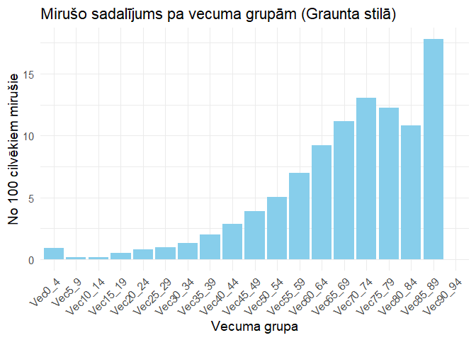
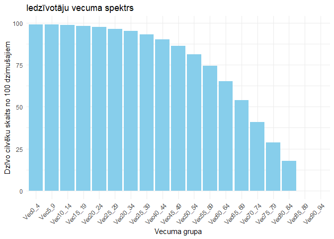

1.mājas darbs: datizrace kapsētā
================
Jekaterīna Butkeviča,
2025. gads 12. septembris

Ar šāda veida uzdevumiem sastapos pirmo reizi un neesmu pārliecināta, kā
to parasti noformē Datorikas fakultātē. Tādēļ uzdevumu noformēju līdzīgi
tam, kā pie mums – Bioloģijas fakultātē – parasti tiek sagatavoti
līdzīgi uzdevumi. Vai šis noformējums atbilst sagaidītajam? Būšu ļoti
pateicīga par komentāriem un ieteikumiem attiecībā uz uzdevuma
iesegšanas formātu.

## Datu avots

Man neizdevās atrast datubāzi, kur būtu pieejami atsevišķi ieraksti ar
precīzu vecumu vai dzimšanas un mirstības gadu. Savukārt manuāla datu
kopēšana no <https://timenote.info/> neveido dabisku izlasi. Tādēļ es
izmantoju datus no Pasaules [Veselības
organizācijas](https://www.who.int/) (World Health Organization), kur
(izvēlētais fails) satur informāciju par mirušo cilvēku skaitu no 1988.
līdz 2002. gadam pa vecuma grupām. Vecuma grupas nesakrīt pilnībā ar
uzdevumā apskatītajām, tomēr, manuprāt, tas neietekmē algoritmu izpildi.
Dati lejupielādei pieejami
[šeit](https://www.who.int/data/data-collection-tools/who-mortality-database).

## Datu sakārtošana

Datubāze satur informāciju par mirušo skaitu gadā katrā vecuma grupā,
sadalot to pēc dzimuma un mirstības iemesliem. Tādēļ sākumā sakārtoju
datus. Tā kā šī darbība nebija uzdevuma daļa, to neskaidrošu detalizēti.

``` r
pirmie_dati <- read.csv(here("datizrace_kapos", "Morticd10_part1.csv"))

dati <- pirmie_dati[pirmie_dati$Country == 4186,] # atlasu Latviju

apvienoti_dati <- dati %>%
  group_by(Sex) %>%         # grupēju pēc dzimuma
  summarise(across(starts_with("Death"), sum, na.rm = TRUE))
apvienoti_dati$Sex <- ifelse(apvienoti_dati$Sex == 1, "Vīrietis", "Sieviete")


# Apvienot vecumu 0-4 gadi vienā intervālā, jo tie sniegti pa atsevišķiem gadiem
apvienoti_dati$Vec0_4 <- rowSums(apvienoti_dati[, c(
  "Deaths2", "Deaths3", "Deaths4", "Deaths5", "Deaths6"
  )], na.rm = TRUE)

# Izdzest liekas kolonnas
apvienoti_dati <- apvienoti_dati %>%
  select(-Deaths1, -Deaths2, -Deaths3, -Deaths4,
         -Deaths5, -Deaths6,-Deaths25, -Deaths26)

# Precizēt nosaukumus
apvienoti_dati <- apvienoti_dati %>%
  rename(
    Vec5_9 = Deaths7, Vec10_14 = Deaths8, Vec15_19 = Deaths9,
    Vec20_24 = Deaths10, Vec25_29 = Deaths11, Vec30_34 = Deaths12,
    Vec35_39 = Deaths13, Vec40_44 = Deaths14, Vec45_49 = Deaths15,
    Vec50_54 = Deaths16, Vec55_59 = Deaths17, Vec60_64 = Deaths18,
    Vec65_69 = Deaths19, Vec70_74 = Deaths20, Vec75_79 = Deaths21,
    Vec80_84 = Deaths22, Vec85_89 = Deaths23, Vec90_94 = Deaths24
  )

# Pareizā kolonnu secība 
apvienoti_dati <- apvienoti_dati %>%
  relocate(Vec0_4, .after = 1)
```

Iegūtā datu tabula satur mirušo cilvēku skaitu katrā vecuma grupā,
sadalot to pa dzimumiem.

``` r
head(apvienoti_dati)
```

    ## # A tibble: 2 × 20
    ##   Sex      Vec0_4 Vec5_9 Vec10_14 Vec15_19 Vec20_24 Vec25_29 Vec30_34 Vec35_39
    ##   <chr>     <dbl>  <int>    <int>    <int>    <int>    <int>    <int>    <int>
    ## 1 Vīrietis   2422    554      504     1634     3074     3742     4850     7136
    ## 2 Sieviete   1938    282      292      648      704      872     1320     2184
    ## # ℹ 11 more variables: Vec40_44 <int>, Vec45_49 <int>, Vec50_54 <int>,
    ## #   Vec55_59 <int>, Vec60_64 <int>, Vec65_69 <int>, Vec70_74 <int>,
    ## #   Vec75_79 <int>, Vec80_84 <int>, Vec85_89 <int>, Vec90_94 <int>

## Pirmais uzdevums

**Aprēķināt, cik ilgi (vidēji) dzīvos cilvēks, kurš jau ir sasniedzis
noteiktu vecumu (piemēram, 65 gadus)**

Algoritma apraksts:

1.  Atlasīt tikai tās kolonnas, kas satur informāciju par cilvēkiem,
    kuri ietipst vecuma intervāla 65+ gadi (`Vec65_69`, `Vec70_74`
    utt.).
2.  Aprēķināt katras vecuma grupas vidējo vecuma vērtību, jo precīzu
    vecumu mēs nezinam, tādēļ šāda vējda mēgīnām līdzsvarot. Piemēram,
    `Vec65_69` → vidējais vecums = 67 gadi.
3.  Aprēķināt kopējo cilvēku skaitu ≥65 gadi. Sasumēt visus mirušos
    šajās vecuma grupās (pa dzimumiem).
4.  Aprēķināt vidējo atlikušās dzīves ilgumu pēc formulas:  
    $$
    \text{Videjais atlikusais dzives ilgums} = \frac{\sum (\text{miruso skaits} \times \text{videjais vecums grupa}) - 65 \times \text{kopejais skaits}}{\text{kopejais skaits}}
    $$
5.  Iegustāmais rezultāts: vidējais dzīves ilgums pēc 65 gadu vecuma
    katram dzimumam.

Sākumā definējam interesējošos vecuma intervālus un aprēķinām katra
intervāla vidējo vecuma vērtību.

``` r
vecuma_kolonnas <- c("Vec65_69","Vec70_74","Vec75_79","Vec80_84","Vec85_89","Vec90_94")
vidus_vecums <- c(67,72,77,82,87,92)  # vidējie vecumi katrai grupai
```

Aprēķinām vidējo atlikušo dzīves ilgumu katram dzimumam.

``` r
rezultats1 <- apvienoti_dati %>%
  rowwise() %>%
  mutate(
    # skaits un vecuma grupas * skaits
    kop_65_plus = sum(c_across(all_of(vecuma_kolonnas))),
    suma_vidus = sum(c_across(all_of(vecuma_kolonnas)) * vidus_vecums),
    vid_pec_65 = (suma_vidus - 65 * kop_65_plus)/kop_65_plus
  ) %>%
  select(Sex, vid_pec_65)
```

*Atbilde:*

``` r
rezultats1
```

    ## # A tibble: 2 × 2
    ## # Rowwise: 
    ##   Sex      vid_pec_65
    ##   <chr>         <dbl>
    ## 1 Vīrietis       10.4
    ## 2 Sieviete       14.4

## Otrais uzdevums

**Aprēķināja mirušo cilvēku vecumu sadalījumu pa vecuma grupām
(histogrammu): cik no 100 cilvēkiem miruši attiecīgi vecumā 0-9, 10-19,
20-29, 30-39 utt.**

Algoritma apraksts:

1.  Apvienot dzimumus, saskaitot vērtības vecuma intervālos.
2.  Aprēķināt kopējo mirušo skaitu visās vecuma grupās.
3.  Katram vecuma intervālam aprēķinām proporciju = (skaits grupā /
    kopējais skaits) \* 100

Summejam abu dzimumu skaitus.

``` r
dati_kopa <- apvienoti_dati %>%
  select(-Sex) %>%       # atmet dzimumu
  summarise(across(everything(), sum, na.rm = TRUE))
```

Aprēķinam kopējo mirušo skaitu.

``` r
total <- sum(dati_kopa)
```

Pārvēršam datus “long” formā un aprēķinām proporciju.

``` r
proporcijas <- dati_kopa %>%
  pivot_longer(cols = everything(),
               names_to = "Vecuma_grupa",
               values_to = "Skaits") %>%
  mutate(Proporcija = Skaits / total * 100)
```

Rezultāts:

``` r
proporcijas
```

    ## # A tibble: 19 × 3
    ##    Vecuma_grupa Skaits Proporcija
    ##    <chr>         <dbl>      <dbl>
    ##  1 Vec0_4         4360      0.938
    ##  2 Vec5_9          836      0.180
    ##  3 Vec10_14        796      0.171
    ##  4 Vec15_19       2282      0.491
    ##  5 Vec20_24       3778      0.812
    ##  6 Vec25_29       4614      0.992
    ##  7 Vec30_34       6170      1.33 
    ##  8 Vec35_39       9320      2.00 
    ##  9 Vec40_44      13224      2.84 
    ## 10 Vec45_49      18024      3.88 
    ## 11 Vec50_54      23336      5.02 
    ## 12 Vec55_59      32582      7.01 
    ## 13 Vec60_64      42820      9.21 
    ## 14 Vec65_69      51896     11.2  
    ## 15 Vec70_74      60810     13.1  
    ## 16 Vec75_79      57052     12.3  
    ## 17 Vec80_84      50284     10.8  
    ## 18 Vec85_89      82856     17.8  
    ## 19 Vec90_94          0      0

Rezultāta vizualizācija:

<!-- -->

## Trešais uzdevums

**No iegūtas histogrammas iegūt šobrīd dzīvojošo cilvēku vecumu
spektru.**

1.  Pārreiķināt uz sākotnējais skaits = 100.
2.  Katram vecuma intervālam: proporciju (mirušo % no 100) atņemt to no
    “dzīvo” cilvēku skaita.
3.  Pārrēķināt uz procentiem.

``` r
iedziv_spektrs <- proporcijas %>%
  mutate(Proporcija = Proporcija) %>%
  arrange(Vecuma_grupa) %>%
  # 2. Aprēķinām kumulatīvo summu (cik nomirst līdz attiecīgajam vecumam)
  mutate(Kumul_mirušie = cumsum(Proporcija),
         Dzīvi = 100 - Kumul_mirušie)
```

Rezultāts:

``` r
iedziv_spektrs
```

    ## # A tibble: 19 × 5
    ##    Vecuma_grupa Skaits Proporcija Kumul_mirušie Dzīvi
    ##    <fct>         <dbl>      <dbl>         <dbl> <dbl>
    ##  1 Vec0_4         4360      0.938         0.938  99.1
    ##  2 Vec5_9          836      0.180         1.12   98.9
    ##  3 Vec10_14        796      0.171         1.29   98.7
    ##  4 Vec15_19       2282      0.491         1.78   98.2
    ##  5 Vec20_24       3778      0.812         2.59   97.4
    ##  6 Vec25_29       4614      0.992         3.58   96.4
    ##  7 Vec30_34       6170      1.33          4.91   95.1
    ##  8 Vec35_39       9320      2.00          6.91   93.1
    ##  9 Vec40_44      13224      2.84          9.76   90.2
    ## 10 Vec45_49      18024      3.88         13.6    86.4
    ## 11 Vec50_54      23336      5.02         18.7    81.3
    ## 12 Vec55_59      32582      7.01         25.7    74.3
    ## 13 Vec60_64      42820      9.21         34.9    65.1
    ## 14 Vec65_69      51896     11.2          46.0    54.0
    ## 15 Vec70_74      60810     13.1          59.1    40.9
    ## 16 Vec75_79      57052     12.3          71.4    28.6
    ## 17 Vec80_84      50284     10.8          82.2    17.8
    ## 18 Vec85_89      82856     17.8         100       0  
    ## 19 Vec90_94          0      0           100       0

Rezultāta vizualizācija:

<!-- -->
